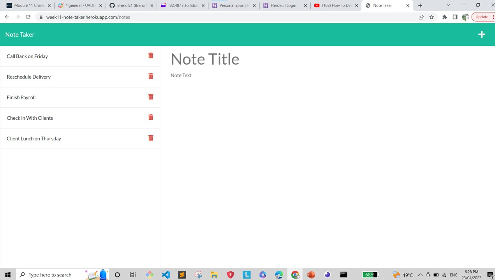
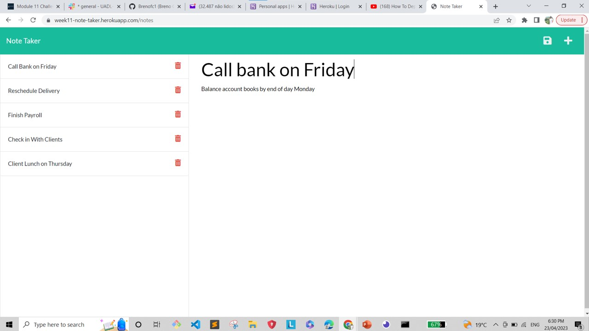

# Module 11 Challenge: Express.js Challenge: Note Taker
## Description

In this challenge it was created an app that can help the user to manage some importants note as a To Do List. On the app the user can add notes, read, delete.

The user can insert activities as shopping list, meeting date and time notes, bank compromisses notes, etc.

e.g: Title: Call Bank on Friday
    Note: Balance account books by end of day Monday.

## Table of Contents

- [Screenshot](#screenshot)
- [Deployed Application](#deployed-application)

## Screenshot
Screen Shot of the front-end application.

## Deployed Application
Link: https://week11-note-taker.herokuapp.com/
